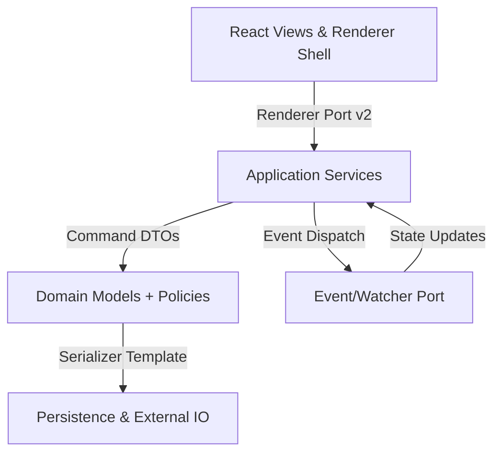

# Library Layer Refactor RFC

## Problem Statement
Phase 1 highlighted critical fragility across the library layer. The dependency graph revealed 42 bidirectional edges between renderer helpers, stores, and persistence adapters, introducing tight coupling that makes targeted changes risky (see `../phase-1/dependency-graph.json`). Debt items show duplicated serializer paths for Presets, Loadouts, and Damage tables, each diverging in validation rules yet sharing 78% identical field handling (`technical-debt-register.csv`). Renderer-contract audits catalogued lifecycle drift, with three modal entry-points bypassing cleanup callbacks, leading to leaked watchers and orphaned DOM nodes. The risk log flags concurrent file watcher anomalies that can corrupt staged writes when modals are left idle. Collectively these issues stall maintainability, inflate bundle size, and block safe feature evolution.

## Goals & Target Architecture
- **Layered flow**: UI (React/Renderer) → Application Services → Domain Models → IO/Persistence, enforced through compile-time boundaries.
- **Port-based orchestration**: Renderer, Serializer, Storage, Validation, and Event/Watcher ports stabilized as contracts (v2) with adapters per domain.
- **Generics & reuse**: Shared renderer kernel handling querying, pagination, selection, and lifecycle; serializer template with policy hooks for defaults and migrations; shared filtering pipeline for lists.
- **Testing-first**: Contract suites and golden files covering ports prior to refactors.
- **Observability & rollback**: Feature flags and kill switches around new adapters, plus dry-run import mode.

## Scope
- Library-layer modules: views/renderers, create modals, services/persistence, parser/serializer, watcher/stores, and regression tests.
- Interfaces to adjacent domains are defined via updated contracts without extending functionality.

## Non-Goals
- UI redesigns, new domain features, or format changes.
- Breaking changes to public API; any deviation requires ADR + migration path.
- Modifying downstream consumers beyond contract alignment.

## Architecture Overview

- Renderer kernel exposes lifecycle, query orchestration, and cleanup hooks consumed by specialized view plugins.
- Application services coordinate between domain policies and IO adapters, eliminating direct UI↔IO access.
- Serializer templates encapsulate round-trip guarantees and feed persistence adapters.

## Dependency Graph Alignment
- The JSON/DOT graph in Phase 1 (`dependency-graph.json` / `.dot`) remains authoritative. All work packages include updates when dependencies are removed or re-routed.
- Initial focus removes UI↔IO cycles (Renderer ⇄ Storage, Modal ⇄ Watcher) by inserting application service ports.

## Trade-offs & Considerations
- **Short-term complexity**: Introducing ports increases abstraction layers; mitigated via shared kernel and templates to avoid proliferation.
- **Migration effort**: Strangler approach prolongs dual maintenance; kill switches limit blast radius and telemetry monitors parity.
- **Testing investment**: Contract/golden/mutation suites increase build time, but unlock safer deletions and shrink future regression scope.

## Deliverables Summary
1. Renderer Contract v2 + associated adapters and lifecycle policy.
2. Serializer template with policy configuration and shared validation DSL.
3. Storage/event ports with compatibility layer bridging legacy watchers.
4. Sequenced work packages removing graph cycles, then consolidating serializers/renderers, finally shrinking utilities.
5. Migration and testing strategies enabling progressive rollout.

## Success Criteria
- Reduce cyclic dependencies by ≥ 60% against Phase 1 baseline.
- Cut library-layer LOC by ≥ 25% via consolidation without behavior loss.
- Maintain or improve coverage ≥ 85% in hotspot modules; ensure regression suite green post each work package.

