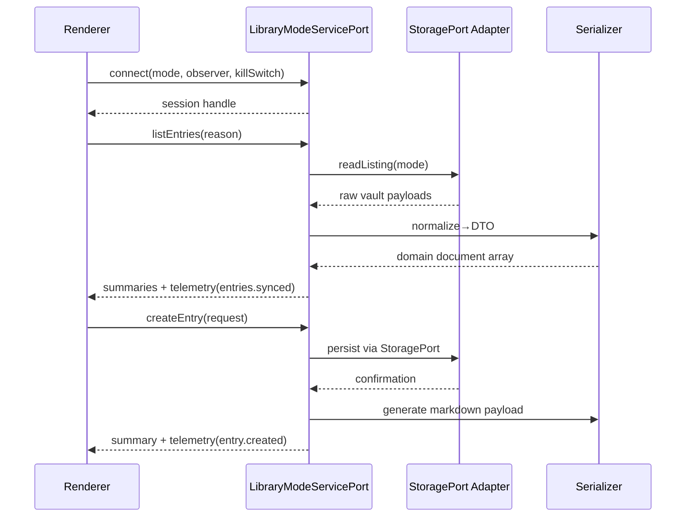

# LIB-TD-0003 – Umsetzung & Nachweis

## Plan
- Bestandsaufnahme der Renderer-Abhängigkeiten auf Verzeichnis-Ebene (Creatures, Spells, Items, Equipment, Terrains, Regions) und Ableitung gemeinsamer DTO-Schnittstellen für Listings und Detaildokumente.
- Definition eines Session-orientierten Service-Ports mit Observer-Hooks, Telemetrie-Events sowie Kill-Switch-Auswertung für Legacy-Fallbacks.
- Dokumentation der Composition-Kette (Renderer → Service-Port → StoragePort → Serializer) inklusive Event-Themen und Sequenzdiagramm.

## Umsetzung
- `src/apps/library/core/library-mode-service-port.ts` spezifiziert Domain-spezifische Summaries, Dokumente und Create-Requests, fasst Descriptoren zusammen und liefert Composition-Pläne für jeden Modus.
- Kill-Switch-Hilfsfunktionen kapseln die Feature-Flags `library.service.enabled` und `library.service.legacyFallback`, sodass Renderer deterministisch zwischen Service-Port und Legacy-Pfaden wählen können.
- Telemetrie- und Fehlerverträge definieren Adapter-Kennungen (`legacy` vs. `storage-port`) und Events für Session-Lifecycle, Synchronisation und Mutation.

## Tests
- `npm run test -- --run tests/library/library-mode-service-port.test.ts`

## Dokumentation
- Kanban-Eintrag zu LIB-TD-0003 nach „Ready for Phase 4“ verschoben und Composition-/Flag-Details ergänzt.
- Offene Frage zur Streaming-Notwendigkeit im Backlog als geklärt markiert.
