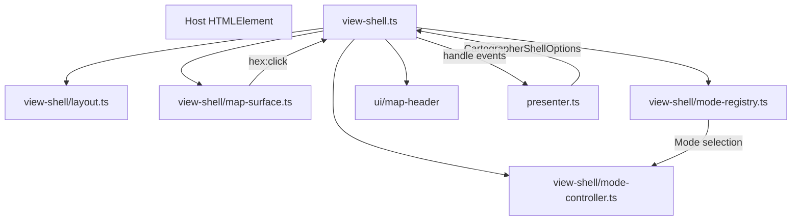

# Cartographer View Shell – Overview

## Strukturdiagramm

## Verantwortlichkeiten
- **`view-shell.ts`** – Orchestriert den Aufbau der Cartographer-Oberfläche. Verkabelt Layout, Map-Surface, Mode-Registry und Mode-Controller zu einem Handle, das der Presenter konsumiert. Kümmert sich ausschließlich um UI-Signale und delegiert Geschäftslogik an die Callbacks.
- **`view-shell/layout.ts`** – Erzeugt die Grundstruktur des Cartographer-Shell-DOM (Header, Map-Bereich, Sidebar) und sorgt für das Aufräumen des Hosts.
- **`view-shell/map-surface.ts`** – Baut den `ViewContainer` für die Karte, kapselt Overlay-Steuerung und stellt einen bereinigten Host für das Map-Rendering zur Verfügung.
- **`view-shell/mode-registry.ts`** – Verwaltet die Mode-Dropdown-Darstellung. Unterstützt dynamisches Registrieren/Deregistrieren von Modi und aktualisiert den Trigger-Button sowie ARIA-Status.
- **`view-shell/mode-controller.ts`** – Stellt einen Abort-gestützten Controller für Modewechsel bereit. Jeder Wechsel erzeugt einen frischen `AbortController`, wodurch laufende `onEnter`/`onFileChange`-Arbeit beim Presenter sauber abgebrochen werden kann.

## Daten- & Ereignisfluss
1. **Initialisierung**: Der Presenter ruft `createCartographerShell` und übergibt die initiale Mode-Liste. Die Shell erzeugt Layout, Map-Surface und registriert das Mode-Dropdown im Header.
2. **Mode-Wechsel**: Benutzer-Interaktionen im Dropdown lösen `ModeRegistry.onSelect` aus. Der Mode-Controller triggert `callbacks.onModeSelect(modeId, { signal })`. Bereits laufende Umschaltungen werden per `AbortController.abort()` beendet.
3. **Dateiwechsel**: Der Presenter aktualisiert `setFileLabel`, `setOverlay`, `clearMap` etc. Das Shell-Handle leitet diese Befehle an Header und Map-Surface weiter, ohne eigenen Status zu halten.
4. **Hex-Interaktionen**: Das Map-Surface fängt `hex:click`-Events und delegiert sie an `callbacks.onHexClick`. UI-spezifische Präventionslogik (preventDefault/stopPropagation) bleibt in der Shell konzentriert.

## Skript-Beschreibungen
- **`view-shell.ts`** – Stellt `CartographerShellHandle` bereit, verwaltet Mode- und Layout-Zustände und sorgt für sauberes Aufräumen aller Teil-Services.
- **`view-shell/layout.ts`** – Minimaler Helfer für Host-Setup & -Teardown.
- **`view-shell/map-surface.ts`** – Wrapper um `createViewContainer`, inklusive Overlay- und Cleanup-Hilfen.
- **`view-shell/mode-registry.ts`** – Dropdown-Manager mit Outside-Click-Handling, ARIA-Statuspflege und dynamischer Mode-Liste.
- **`view-shell/mode-controller.ts`** – Abort-fähiger Mode-Workflow, der Mehrfach-Wechsel und Destroy-Aufrufe robust verarbeitet.

## Besondere Hinweise
- Der Mode-Controller reicht den `AbortSignal` direkt an die Presenter-Callbacks weiter. Presenter sollten laufende `onEnter`/`onFileChange`-Operationen auf den `signal.aborted`-Status prüfen und ggf. eigene Ressourcen räumen.
- Dynamische Mode-Listen: Die Shell bietet `setModes`, `registerMode` und `deregisterMode`, um externe Registries zu unterstützen. Änderungen werden sofort ins Dropdown gespiegelt.
- Das Layout räumt den Host konsequent auf (`empty()` & `removeClass`), wodurch wiederholtes Mounten/Unmounten keine Zombie-Knoten hinterlässt.
