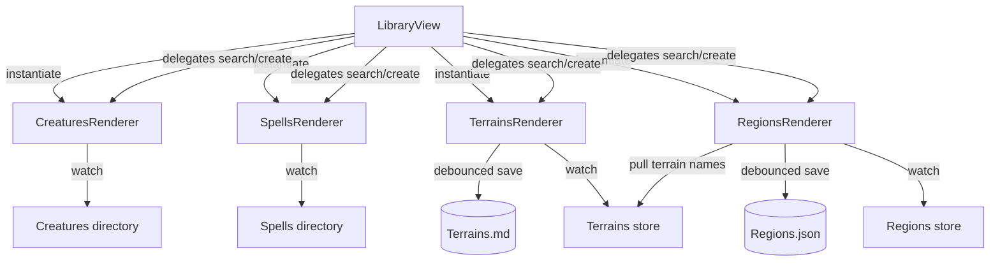

# Library View – Struktur & Persistenz

## Architektur auf einen Blick

Der `LibraryView` reduziert sich auf die Shell-Aufgabe: Mode-Umschaltung, Suchfeld, Beschreibungstext und Einbindung der Renderer. Für jeden Modus existiert ein dedizierter Renderer, der UI, Watcher und Persistenzkabelung kapselt.

## Module & Verantwortlichkeiten

| Modul | Aufgabe |
| --- | --- |
| `view.ts` | Initialisiert die View-Shell, hält den aktuellen Modus & Query-String und delegiert an Mode-spezifische Renderer. |
| `view/mode.ts` | Definiert das `ModeRenderer`-Interface, gemeinsame Hilfslogik (`scoreName`) sowie eine `BaseModeRenderer`-Klasse mit Cleanup-Handling. |
| `view/creatures.ts` | Lädt & beobachtet Kreaturen-Dateien, rendert Trefferliste und öffnet Dateien über Obsidian. |
| `view/spells.ts` | Analog zu `creatures`, jedoch für Zauber. |
| `view/terrains.ts` | Stellt Terrain-Palette dar, verwaltet lokale Mutationen und speichert mit 500 ms Debounce in `Terrains.md`. |
| `view/regions.ts` | Verwaltet Regionen inklusive Terrain-Auswahl, konsumiert Terrain-Liste und speichert Änderungen mit 500 ms Debounce. |

## Datenfluss & Persistenz

1. **Mode-Aktivierung:** `LibraryView.activateMode` zerstört ggf. den bisherigen Renderer (inkl. Watcher) und erzeugt eine neue Instanz. Anschließend wird die aktuelle Suchanfrage übergeben und die Liste gerendert.
2. **Watcher-Management:** Jeder Renderer registriert die benötigten Datei-Watcher selbstständig über `BaseModeRenderer.registerCleanup`. Beim Destroy werden alle Listener aufgehoben und das Container-Element geleert.
3. **Such- und Create-Fluss:** Der Suchstring wird zentral gehalten und per `setQuery` an den aktiven Renderer weitergereicht. Der „Erstellen“-Button ruft `handleCreate` des aktiven Renderers auf, wodurch Kreaturen/Zauber modale Workflows starten oder Terrains/Regionen direkt vorbereitet werden.
4. **Terrains-Persistenz:** Terrain-Änderungen aktualisieren zunächst nur den lokalen Zustand. Ein Debounce (500 ms) bündelt alle Eingaben, bevor `saveTerrains` ausgeführt wird. Nach dem Persistieren werden Daten erneut geladen, um externe Änderungen zu berücksichtigen.
5. **Regions-Persistenz:** Regionen verhalten sich identisch – Eingaben werden lokal gehalten und erst nach dem Debounce in `saveRegions` geschrieben. Terrain-Namen werden separat beobachtet, sodass Dropdowns automatisch neue Terrains anbieten.

## Skriptbeschreibungen

- **`view.ts`** – Komponiert die Library-Oberfläche, pflegt Modus-Buttons, Query und Quelle-Text, erzeugt Renderer instanziell und räumt sie sauber wieder auf.
- **`view/mode.ts`** – Abstrakte Basisschicht für Renderer mit Cleanup-Registrierung und Namensscoring.
- **`view/creatures.ts` / `view/spells.ts`** – Einfache Listenrenderer, die Obsidian-Dateien per Button öffnen und auf Verzeichnisänderungen reagieren.
- **`view/terrains.ts`** – Enthält Terrain-spezifische UI mit Farbwähler, Geschwindigkeitsfeld, Debounce-Speichermechanismus und Sicherstellung des leeren Eintrags.
- **`view/regions.ts`** – Rendert Regionen inklusive Terrain-Auswahl (mit Such-Dropdown) und debounced Persistenz plus Dropdown-Aktualisierung bei Terrain-Änderungen.

## Feature-Notizen

- **Debounced Saves:** Terrains und Regionen lösen keine direkten Vault-Schreibzugriffe pro Tastendruck mehr aus; Änderungen werden gesammelt und nach 500 ms Inaktivität geschrieben.
- **Sauberer Lifecycle:** Renderer übernehmen ihre Watcher komplett selbst und geben sie beim Wechsel frei, wodurch `LibraryView` keine zentrale Cleanup-Liste mehr benötigt.
- **Erweiterbarkeit:** Neue Modi können über zusätzliche Renderer eingeführt werden, ohne `LibraryView` mit Mode-spezifischer Logik zu füllen.

## To-Do
- [Terminologie vereinheitlichen](../../../todo/ui-terminology-consistency.md)
